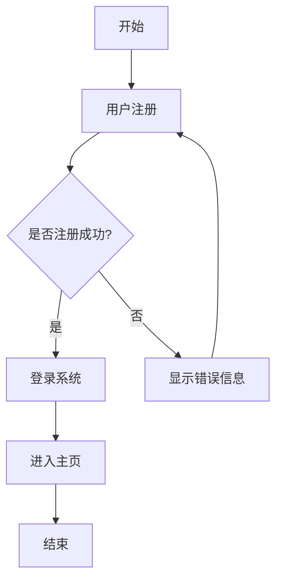

# Mermaid 图表生成器

[](https://nextjs.org/)
[](https://mermaid.js.org/)
[](https://www.typescriptlang.org/)
[](LICENSE)

一个现代化的在线图表生成工具，基于 Next.js 和 Mermaid.js 开发。通过简单的文本描述，自动生成专业的流程图、时序图、类图等多种图表。支持实时预览、主题切换、历史记录等功能，让图表创建变得简单高效。

## ✨ 功能特点

- 🎨 支持多种图表类型（流程图、时序图、类图等）
- 🤖 AI 驱动的自然语言转图表
- 🌓 深色/浅色主题切换
- ✏️ 实时编辑和预览
- 📝 历史记录保存
- 📋 一键复制图表代码

## 🛠️ 技术栈

- [Next.js](https://nextjs.org/) - React 框架
- [Mermaid.js](https://mermaid.js.org/) - 图表渲染引擎
- [Tailwind CSS](https://tailwindcss.com/) - CSS 框架
- [Radix UI](https://www.radix-ui.com/) - UI 组件库
- [ZChat API](https://api.zchat.tech/) - AI 接口

## 🚀 快速开始

### 本地开发

1. 克隆项目

```bash
git clone https://github.com/yourusername/mermaid-generator.git
cd mermaid-generator
```

2. 安装依赖

```bash
npm install
```

3. 配置环境变量

创建 `.env.local` 文件并添加以下配置：

```env
ZCHAT_API_KEY=your_api_key_here
```

4. 启动开发服务器

```bash
npm run dev
```

访问 [http://localhost:3000](http://localhost:3000) 查看应用。

## 📖 使用指南

1. 在输入框中输入你想要可视化的文本描述
2. 点击「生成图表」按钮，等待 AI 生成图表代码
3. 在预览区域实时查看生成的图表效果
4. 可以直接编辑生成的 Mermaid 代码进行微调
5. 使用复制按钮获取图表代码
6. 查看历史记录，随时回顾之前生成的图表

## 🌟 示例

输入文本：
```
用户注册登录流程
```

生成的图表：


## 📦 部署

项目可以一键部署到 Vercel 平台：

[](https://vercel.com/new/clone?repository-url=https%3A%2F%2Fgithub.com%2Fyourusername%2Fmermaid-generator)

部署时请确保配置以下环境变量：
- `ZCHAT_API_KEY`: ZChat API 密钥

## 📄 开源协议

本项目采用 [MIT License](LICENSE) 开源协议。